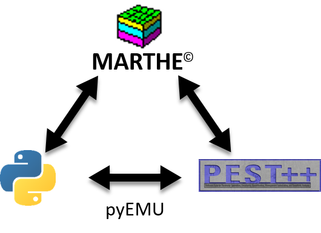
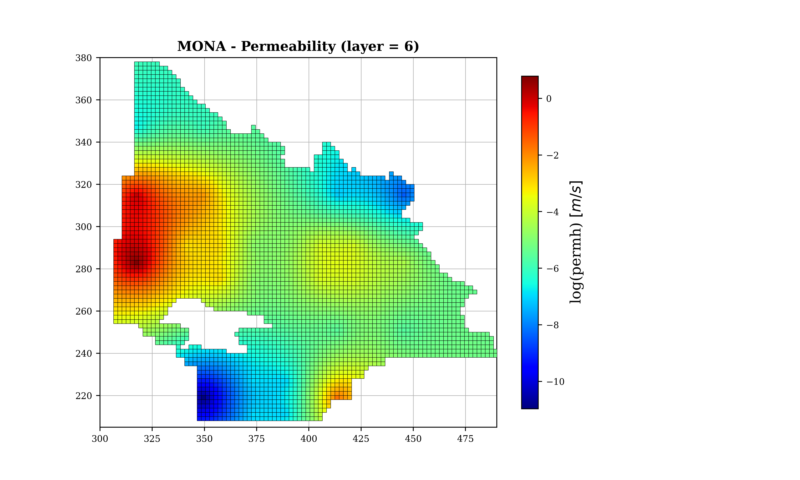

<p align="center">
  
</p>


Introduction
-----------------------------------------------

PyMarthe (v1.0) is a python wrapper acting as a "coupling interface" between [MARTHE (v7.5)](https://www.brgm.fr/fr/logiciel/marthe-logiciel-modelisation-ecoulements-souterrains) hydrogeological numerical models (BRGM) and optimization algorithms provided by the [PEST++](https://github.com/usgs/pestpp) facilities. 


Getting Started
-----------------------------------------------

## Load/manage MARTHE model
```python
# -- Import usefull packages
import os, sys
import pandas as pd
import numpy as np
import matplotlib.pyplot as plt
from pymarthe import MartheModel

# -- Load MARTHE Model
mm = MartheModel('mona.rma', spatial_index=True)

# -- Load non distributed properties
mm.load_prop('aqpump')  # aquifer pumping
mm.load_prop('soil')    # soil properties

# -- Load hydraulic distributed properties
hprops = ['permh', 'emmca', 'emmli', 'kepon']
for hprop in hprops:
    mm.load_prop(hprop)

# -- Extract field data (by filtering)
mm.prop['permh'].get_data(layer=[4,5,6])

# -- Extract field data (by sampling)
mm.prop['permh'].sample(x = [323.1,333.4],
                        y = [277.11,289.3],
                        layer = 4)

# -- Modify/Write field values
mm.prop['permh'].set_data(2.3e-3, layer=2, inest=0)
mm.prop['permh'.write_data()

# -- Plot field values
plt.rc('font', family='serif', size=8)
fig, ax = plt.subplots(figsize=(10,6))
extent = (300,205,490,380)
ax = mf.plot(ax=ax, layer=6, log=True,
             extent= extent, edgecolor='black', 
             lw=0.3, cmap='jet', zorder=10)
ax.set_title('MONA - Permeability (layer = 6)',
             fontsize = 12, fontweight="bold")
```

<p align="center">
  
</p>


## Run MARTHE model
```python
# -- Make silent run
mm.remove_autocal()
mm.make_silent()
mm.run_model(exe_name='Marth_R8', verbose=False)

```

## PEST interfacing
```python
# -- Build optimisation
from pymarthe import MartheOptim
from pymarthe.utils import pest_utils

dirs = {f'{f}_dir': f for f in ['par', 'tpl', 'ins', 'sim'] }
mopt = MartheOptim(mm, name='mona_opt',**dirs)

# -- Add observations
for obsfile in os.listdir(dirs['obs_dir']):
    mopt.add_obs(data = obsfile, datatype='head')

# -- Add list-like parameters (based on KeysMultiIndex)
pump_kmi = pest_utils.get_kmi(mobj = mm.prop['aqpump'],
                              keys = ['boundname', 'layer', 'istep'])

mopt.add_param(parname = 'pumping',
               mobj = mm.prop['aqpump'],
               kmi = pump_kmi,
               value_col = 'value')

soil_kmi = pest_utils.get_kmi(mobj = mm.prop['soil'],
                              keys = ['soilprop', 'zone'])

mopt.add_param(parname = 'soil',
               mobj = mm.prop['soil'],
               kmi = soil_kmi,
               value_col = 'value')

# -- Manage transformations
mopt.set_obs_trans(trans = 'log', datatype = 'head')
mopt.set_param_trans(trans = 'lambda x: np.log10(-x + 1)',
                     btrans = 'lambda x: - np.power(10, x) + 1',
                     parname= 'pumping')

# -- Write PEST files
mopt.write_parfile()
mopt.write_tpl()
mopt.write_ins()
pst = mopt.build_pst(add_reg0=True, write=True, noptmax = -1, phimlim=0)

# -- Save/write parametrization configuration
mopt.write_config()
```


Contributing
------------------------------------------------

Bug reports, code contributions, or improvements to the documentation are welcome from the community. 
Feel free to suggest improvements by working with your own fork version of PyMarthe. Go to the PyMarthe project page and hit the **Fork** button.
You will want to clone your fork to your machine:

    git clone <url_pymarthe> <pymarthe-yourname>
    cd pymarthe-yourname


Ressources
-----------------------------------------------

+ [MARTHE - online documentation](https://www.brgm.fr/sites/default/files/documents/2020-11/logiciel-marthe-notice-utilisation-generale-rp-64554-fr.pdf)
+ [MARTHE - online User Guide](https://www.brgm.fr/sites/default/files/documents/2020-11/logiciel-marthe-didacticiel-7-5-rp-64997-fr.pdf)
+ [PEST++ - GitHub page](https://github.com/usgs/pestpp)
+ [PEST - homepage](http://www.pesthomepage.org/)
+ [pyEMU - GitHub page](https://github.com/pypest/pyemu)


Disclaimer
----------

This software is totally experimental and is subject to revision. 

